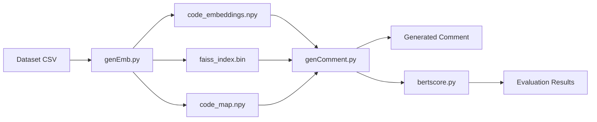

# MICOGen - Multi-Intent Code Comment Generation

A semantic code search and comment generation system that uses CodeBERT embeddings with FAISS indexing and LLM generation to automatically generate meaningful code comments.

## 📋 Table of Contents

- [Overview](#overview)
- [Features](#features)
- [Prerequisites](#prerequisites)
- [Installation](#installation)
- [Usage](#usage)
- [Project Structure](#project-structure)
- [Files Generated](#files-generated)

## 🎯 Overview

This project implements a multi-stage pipeline for code comment generation:

1. **Embedding Generation** (`genEmb.py`): Creates semantic embeddings using CodeBERT and builds a FAISS index for similarity search
2. **Comment Generation** (`genComment.py`): Uses the generated embeddings to find similar code examples and generates comments using CodeLlama
3. **Evaluation** (`bertscore.py`): Evaluates generated comments using BERT Score for semantic similarity

## ✨ Features

- **Semantic Code Search**: Uses CodeBERT embeddings with FAISS for efficient similarity search
- **Multi-Model Support**: Supports multiple LLM backends (CodeLlama, Gemini, GPT-4o Mini)
- **Context-Aware Generation**: Uses similar code examples from a knowledge base to generate relevant comments
- **Efficient Indexing**: FAISS-based fast similarity search over large codebases
- **Comprehensive Evaluation**: BERT Score metrics for semantic similarity assessment (Precision, Recall, F1)

##  Prerequisites

- Python 3.8 or higher
- CUDA-capable GPU (recommended for faster processing)
- 8GB+ RAM minimum, 16GB+ recommended
- ~5GB free disk space for models and embeddings

##  Installation

### Step 1: Clone the Repository

```bash
git clone https://github.com/micogenai/MICOGEN
cd MICOGen
```

### Step 2: Create Virtual Environment

```bash
# Create a virtual environment
python3 -m venv venv

# Activate the virtual environment
# On macOS/Linux:
source venv/bin/activate
# On Windows:
# venv\Scripts\activate
```

### Step 3: Install Required Packages

```bash
# Install Python packages
pip install -r requirements.txt
```

**Note**: If you have a CUDA-capable GPU and want to use GPU acceleration for FAISS, install the GPU version:

```bash
pip install faiss-gpu
```

If you only have a CPU, the default `faiss-cpu` (installed via requirements.txt) will work fine.

### Step 4: Install Ollama and CodeLlama

```bash
# Install Ollama
curl -fsSL https://ollama.ai/install.sh | sh

# Pull CodeLlama 7B Instruct model
ollama pull codellama:7b-instruct
```

This will download the CodeLlama 7B Instruct model (~3.8GB). Make sure you have sufficient disk space.

### Step 5: Verify Installation

```bash
# Test if Ollama is working
ollama run codellama:7b-instruct "Hello"
```

If you see a response, Ollama is installed correctly.

## 🚀 Usage

### Step 1: Generate Embeddings and FAISS Index

First, run `genEmb.py` to create the necessary embeddings and index files. This script will:

- **Automatically download** CodeBERT model (~500MB) on first run (no manual download needed)
- Read the `parent_code_comment_with_title-final.csv` file
- Generate embeddings for all code snippets
- Build a FAISS index for fast similarity search
- Save three files: `code_embeddings.npy`, `faiss_index.bin`, and `code_map.npy`

**Note:** 
- You must have downloaded CodeLlama separately using `ollama pull codellama:7b-instruct` before running the comment generation scripts (see Installation Step 4)
- The `parent_code_comment_with_title-final.csv` file is not included in the repository due to size. Please use your own dataset or obtain it separately

```bash
python genEmb.py
```

**Expected Output:**
- `code_embeddings.npy` (~100MB - 1GB depending on dataset size)
- `faiss_index.bin` (~100MB - 1GB)
- `code_map.npy` (small file, few KB)

⏱️ **Note**: This may take 10-30 minutes depending on your hardware and dataset size.

### Step 2: Generate Comments

Once the embeddings are generated, you can use `genComment.py` to generate comments for your code.

#### Option A: Using genComment.py (CodeLlama via Ollama)

Edit the `input_code` variable in `genComment.py` with your code snippet, then run:

```bash
python genComment.py
```

#### Option B: Using geminiGenComment.py (Gemini API)

1. Get a Gemini API key from [Google AI Studio](https://makersuite.google.com/app/apikey)
2. Update the `api_key` in `geminiGenComment.py` (line 19)
3. Edit the `input_code` variable with your code
4. Run:
```bash
python geminiGenComment.py
```

#### Option C: Batch Processing with Metrics (GPT-4o Mini)

For batch processing with automated metrics calculation:

1. Set your OpenAI API key in `gpt4ominiGenMetrics.py` (line 30)
2. Adjust `NUM_SAMPLES` for desired batch size (line 29)
3. Run:
```bash
python gpt4ominiGenMetrics.py
```

This will generate comments and compute BLEU, ROUGE-L, and METEOR metrics.

### Step 3: Evaluate Results with BERT Score

After generating comments, you can evaluate the quality of the generated comments using BERT Score for semantic similarity evaluation.

1. Prepare your CSV file with generated comments (output from previous steps)
2. Update the file path in `bertscore.py` to point to your CSV file
3. Ensure your CSV has columns: `comment` (reference) and `GeneratedComment` (generated)

```bash
python bertscore.py
```

This will:
- Compute BERTScore (Precision, Recall, F1) for each comment pair
- Add `BERTScore`, `Precision`, and `Recall` columns to your CSV
- Print mean scores
- Save results to a new CSV file (e.g., `gpt4omini_bertscore.csv`)

**Example Output:**
```
✅ BERTScore calculation complete!
BertScore(F1): 0.847
BertScore(P): 0.862
BertScore(R): 0.833
```

**Reference Files in this Project:**
- `codellama_bertscore.csv` - Results from CodeLlama generation
- `gemini2-5_bertscore.csv` - Results from Gemini generation  
- `gpt4omini_bertscore.csv` - Results from GPT-4o Mini generation

## 📁 Project Structure

```
MICOGen/
├── genEmb.py                      # Generate embeddings and FAISS index
├── genComment.py                  # Generate comments using CodeLlama
├── geminiGenComment.py            # Generate comments using Gemini
├── gpt4ominiGenMetrics.py         # Batch generation with metrics
├── bertscore.py                   # Evaluate results with BERT Score
├── parent_code_comment_with_title-final.csv  # Source dataset
├── manually_labeled_data_20000.xlsx  # Evaluation dataset
├── requirements.txt               # Python dependencies
├── README.md                      # This file
├── [Generated files after running genEmb.py]
│   ├── code_embeddings.npy       # CodeBERT embeddings
│   ├── faiss_index.bin           # FAISS similarity index
│   └── code_map.npy              # Mapping between embeddings and dataset rows
└── [Evaluation results]
    ├── codellama_bertscore.csv    # BERT scores for CodeLlama
    ├── gemini2-5_bertscore.csv   # BERT scores for Gemini
    └── gpt4omini_bertscore.csv   # BERT scores for GPT-4o Mini
```

## 📊 Generated Files

After running `genEmb.py`, you'll get three essential files:

1. **`code_embeddings.npy`**: NumPy array containing semantic embeddings for all code snippets
2. **`faiss_index.bin`**: FAISS index for fast similarity search
3. **`code_map.npy`**: Mapping between embedding indices and original dataset rows

These files are required by `genComment.py`, `geminiGenComment.py`, and `gpt4ominiGenMetrics.py`.

After running evaluation with `bertscore.py`, you'll get CSV files with BERT Score metrics added to your dataset for quality assessment.

## 🔄 Workflow Summary



## ⚙️ Configuration

### genEmb.py
- `MODEL_NAME`: "microsoft/codebert-base" - The embedding model
- `BATCH_SIZE`: 64 - Batch size for embedding generation
- `MAX_LEN`: 256 - Maximum code length for tokenization

### genComment.py
- `k`: 50 - Number of similar codes to retrieve
- Similarity threshold: 0.6 - Minimum similarity for context inclusion
- Top results: 3 - Number of examples to use in the prompt

### bertscore.py
- Update `df = pd.read_csv("datase.csv")` to point to your generated comments CSV
- Ensure CSV has `comment` (reference) and `GeneratedComment` columns
- Output: Adds `BERTScore`, `Precision`, `Recall` columns
- Uses `bert_score` library for semantic similarity evaluation

## 🐛 Troubleshooting

### CUDA Out of Memory
If you encounter CUDA OOM errors, reduce the batch size in `genEmb.py`:
```python
BATCH_SIZE = 32  # or even 16
```

### Ollama Connection Error
Make sure Ollama is running:
```bash
ollama serve
```

### File Not Found Error
Ensure you've run `genEmb.py` first to generate the required index files.

### Model Download Issues

**CodeBERT** (~500MB):
- ✅ Downloads automatically when running `genEmb.py` for the first time
- Stored in HuggingFace cache (usually `~/.cache/huggingface/`)
- No manual download needed

**CodeLlama** (~3.8GB):
- ❌ Does NOT download automatically
- Must be manually pulled using: `ollama pull codellama:7b-instruct` (see Step 4)
- Required BEFORE running `genComment.py`
- Ensure stable internet connection and sufficient time for download

## 📝 Notes

- **CodeBERT** is downloaded automatically on first run of `genEmb.py` (~500MB)
- **CodeLlama** must be downloaded manually using `ollama pull` (see Installation Step 4)
- Ensure you have the `parent_code_comment_with_title-final.csv` file in the working directory
- GPU is recommended but not required - CPU will work with longer processing times
- The FAISS index is optimized for fast similarity search

## 🤝 Contributing

Contributions are welcome! Please feel free to submit a Pull Request.

